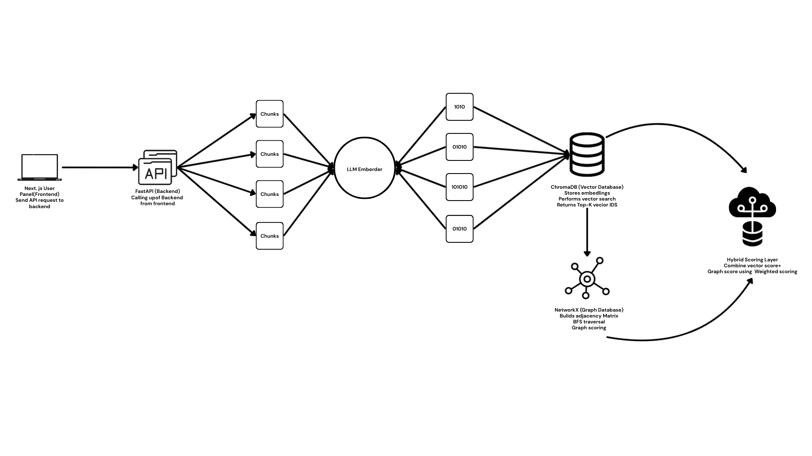

# 🏗️ **System Architecture Overview**

This project implements a **Hybrid Vector + Graph Native Database** built from scratch for efficient AI retrieval.
The system combines:

* **Vector Search** using ChromaDB
* **Graph Reasoning** using NetworkX
* **Hybrid Retrieval** using a weighted scoring model
* **FastAPI** for all CRUD and search endpoints
* **Sentence Transformers** for embedding generation

The architecture is designed to demonstrate how combining semantic similarity (vectors) and relational structure (graph) produces more relevant and context-aware search results than either method alone.

---

# 🖼️ **Architecture Diagram**



---

# 🔍 **Architecture Breakdown**

## 1️⃣ **Client Layer**

The client can be:

* API testing tools (Postman, Thunder Client)
* A frontend UI
* CLI or scripts

The client communicates exclusively with the **FastAPI backend** using REST endpoints for:

* Node creation
* Edge relationships
* Vector search
* Graph traversal
* Hybrid search

---

## 2️⃣ **FastAPI Backend Layer**

FastAPI serves as the central orchestrator of the entire system.

### **Responsibilities:**

* Expose REST APIs
* Manage node CRUD
* Manage graph edges
* Handle embedding generation
* Manage vector storage and retrieval
* Perform hybrid scoring
* Combine graph + vector outputs
* Return ranked results to the client

The backend consists of modular components:

* `routers/` for API endpoints
* `services/` for business logic
* `db/` for graph + vector handling
* `models/` for Pydantic schemas

---

## 3️⃣ **Embedding & Preprocessing Layer**

Whenever a node is created or updated:

* The text content is processed
* An embedding is generated via **SentenceTransformers**
* The embedding is stored into ChromaDB
* A graph node is created with the node ID

This ensures every node has **semantic meaning** + **graph connectivity**.

---

## 4️⃣ **Vector Database (ChromaDB)**

ChromaDB stores all vector embeddings and provides:

* Cosine similarity search
* Top-K retrieval
* Metadata storage
* Persistent local storage

ChromaDB is responsible for fetching the **semantically closest** chunks for any given query.

---

## 5️⃣ **Graph Database (NetworkX)**

NetworkX maintains:

* Node relationships
* Hierarchical structures
* Cross-references
* Multi-hop pathways
* Edge weights

It supports graph traversal queries where the system can explore:

* Depth-1 neighbors (direct relations)
* Depth-2 neighbors (context expansion)
* Multi-hop reasoning

Graph provides **context** and **relationship intelligence** that vectors cannot capture.

---

## 6️⃣ **Hybrid Retrieval Engine**

The hybrid retrieval pipeline is the core innovation of the system.

It works in 3 steps:

### **Step 1 — Vector Retrieval**

* Query text → embedding
* ChromaDB → cosine similarity
* Return top-K vectors

### **Step 2 — Graph Expansion**

For each node retrieved via vector search:

* Traverse the graph (depth 1 or 2)
* Assign graph scores based on closeness
* Collect related nodes

### **Step 3 — Hybrid Scoring**

The final score is computed using:

```
final_score = (cosine_similarity * vector_weight) 
            + (graph_score * graph_weight)
```

This produces outputs that are:

* Semantically relevant
* Contextually grounded
* Reasoned via relationships

This method outperforms vector-only or graph-only systems.

---

## 7️⃣ **Storage Layer**

This consists of:

### **ChromaDB (Vector Store)**

* Embeddings
* Metadata
* Document IDs
* Persistent local database

### **NetworkX Graph (Graph Store)**

* Nodes
* Edges
* Edge weights
* Node attributes
* JSON-based snapshotting

---

## 8️⃣ **Output Layer**

The backend returns structured JSON responses containing:

* Node ID
* Text content
* Metadata
* Cosine similarity
* Graph score
* Final hybrid score
* Sorted results

This makes the system easy to integrate with UI, dashboards, or other services.

---

# 🎯 **Why This Architecture Works**

* **Combines strengths of vector and graph systems**
* **Supports semantic + relational retrieval**
* **More accurate than vector-only or graph-only systems**
* **Modular and scalable**
* **Easy to extend with multi-hop reasoning, weighted edges, filtering, etc.**

---

# 🚀 **Conclusion**

This hybrid Vector + Graph architecture forms a powerful foundation for intelligent retrieval systems such as:

* RAG applications
* Knowledge assistants
* Research tools
* Enterprise knowledge bases
* Documentation search engines

By combining vectors for meaning with graphs for structure, this system achieves **significantly more relevant AI-driven retrieval**.

---

# DevForge Test Cases

Below are the API endpoints tested in `devforge_test_case.py` with their corresponding sample JSON payloads.

## 1. Create Node
**POST** `/nodes`

```json
{
    "id": "doc1",
    "text": "Redis caching strategies",
    "metadata": { "type": "article", "tags": ["cache", "redis"] },
    "embedding": null,
    "regen_embedding": true
}
```

## 2. Get Node
**GET** `/nodes/{id}`

Example: `/nodes/doc1`

## 3. Update Node
**PUT** `/nodes/{id}`

```json
{
    "text": "Updated redis caching guide",
    "metadata": { "type": "guide" },
    "regen_embedding": true
}
```

## 4. Delete Node
**DELETE** `/nodes/{id}`

Example: `/nodes/doc7`

## 5. Create Edge
**POST** `/edges`

```json
{
    "source": "doc1",
    "target": "doc4",
    "type": "related_to",
    "weight": 0.8
}
```

## 6. Get Edge
**GET** `/edges/{id}`

Example: `/edges/{edge_id}`

## 7. Update Edge
**PUT** `/edges/{id}`

```json
{
    "weight": 0.95
}
```

## 8. Delete Edge
**DELETE** `/edges/{id}`

Example: `/edges/{edge_id}`

## 9. Vector Search
**POST** `/search/vector`

```json
{
    "query_text": "redis caching",
    "top_k": 5,
    "metadata_filter": { "type": "guide" }
}
```

## 10. Graph Traversal
**GET** `/search/graph`

Example: `/search/graph?start_id=doc6&depth=2`

## 11. Hybrid Search
**POST** `/search/hybrid`

```json
{
    "query_text": "redis caching",
    "vector_weight": 0.6,
    "graph_weight": 0.4,
    "top_k": 5
}
```
